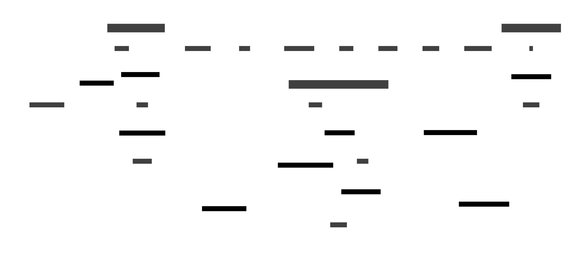

# Stock Trading Application
## System Architecture



## Overview

This application provides stock trading suggestions using AI models. It follows clean architecture principles to ensure maintainability and scalability.

## Architecture

Our application follows a modular architecture designed for scalability and maintainability:

1. Data Pipeline:
   - External Data API: Source of stock data
   - Data Fetcher: Retrieves data from the API
   - Kafka Queue: Manages data flow
   - Data Consumer: Processes queued data

2. Machine Learning:
   - Trainer: Trains AI models on historical data
   - Tradewise Model: Generates stock price forecasts

3. Application Layer:
   - Backend: Serves data and predictions to the frontend
   - User Interface (UI): Presents data and forecasts to users

4. Database:
   - Postgres: Stores historical and forecasted data

## Project Structure

- **/app**: Contains the application code.
  - **/api**: API layer for handling HTTP requests.
  - **/core**: Core business logic and domain models.
  - **/utils**: Utility functions for data loading and AI model operations.
  - **/dashboard**: Flask application for the UI dashboard.

## Documentation Links

Here are the documentation links for the frameworks and libraries used in this project:

- **Keras**: [Keras Documentation](https://keras.io/)
- **FastAPI**: [FastAPI Documentation](https://fastapi.tiangolo.com/)
- **Uvicorn**: [Uvicorn Documentation](https://www.uvicorn.org/)
- **Pandas**: [Pandas Documentation](https://pandas.pydata.org/docs/)
- **Openpyxl**: [Openpyxl Documentation](https://openpyxl.readthedocs.io/en/stable/)
- **NumPy**: [NumPy Documentation](https://numpy.org/doc/)
- **Kafka-Python**: [Kafka-Python Documentation](https://kafka-python.readthedocs.io/en/master/)
- **Flask**: [Flask Documentation](https://flask.palletsprojects.com/)
- **Ray**: [Ray Documentation](https://docs.ray.io/en/latest/)
- **SQLAlchemy**: [SQLAlchemy Documentation](https://docs.sqlalchemy.org/en/20/)
- **Prophet**: [Prophet Documentation](https://facebook.github.io/prophet/)
- **Gym**: [Gym Documentation](https://www.gymlibrary.dev/)
- **Pydantic**: [Pydantic Documentation](https://docs.pydantic.dev/)
- **PyMongo**: [PyMongo Documentation](https://pymongo.readthedocs.io/en/stable/)

## Setup

1. Install dependencies:
   ```bash
   pip install -r requirements.txt
   ```

2. Run the application:
   ```bash
   uvicorn app.api.main:app --reload
   ```

## Usage

### Starting Services

To start all services, use the provided shell script:

```bash
./start_services.sh
```

Access the API at `http://localhost:8000/trade-suggestions` to get trade suggestions.
Access the UI dashboard at `http://localhost:8080`.

## API Documentation

The API is documented using OpenAPI standards. You can access the API documentation by visiting `http://localhost:8000/docs` after starting the server.

## UI Dashboard

A UI dashboard is available to view the forecast vs actual tracking. It displays stock price charts and trade suggestions.

## Testing

Tests are located in the `/tests` directory. Run tests using the appropriate testing framework.

## Technologies Used

- FastAPI: Backend API framework
- Flask: UI Dashboard
- Kafka: Queue system for data pipeline
- PostgreSQL: Database for storing stock data and predictions
- Keras, Prophet, Ray: AI and machine learning libraries
- Plotly: Data visualization

## Contributing

Please read our contributing guidelines before submitting pull requests.

## License

This project is licensed under the MIT License - see the LICENSE file for details.
