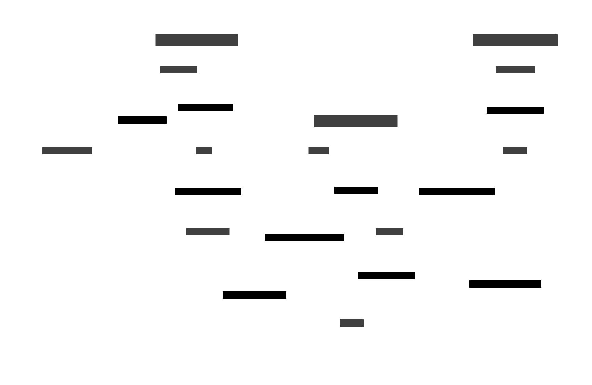

# Stock Trading Application

## Overview

This application provides stock trading suggestions using AI models. It follows clean architecture principles to ensure maintainability and scalability.

## System Architecture



## Architecture

Our application follows a modular architecture designed for scalability and maintainability:

1. Data Pipeline:
   - External Data API: Source of stock data
   - Data Fetcher: Retrieves data from the API
   - Kafka Queue: Manages data flow
   - Data Consumer: Processes queued data

2. Machine Learning:
   - Trainer: Trains AI models on historical data
   - Tradewise Model: Generates stock price forecasts

3. Application Layer:
   - Backend: Serves data and predictions via API

4. Database:
   - PostgreSQL: Stores historical and forecasted data

## Project Structure

- `/app`: Contains the application code.
  - `/api`: API layer for handling HTTP requests.
  - `/core`: Core business logic and domain models.
  - `/services`: Services for data fetching, processing, and AI training.
  - `/pipelines`: Data pipelines for fetching and ingesting stock data.
  - `/connectors`: Database and message queue connectors.
- `/infra`: Infrastructure-related files (Docker, etc.).
- `/migrations`: Database migration scripts.

## Setup

1. Install dependencies:
   ```bash
   pip install -r requirements.txt
   ```

2. Set up environment variables:
   ```
   cp .env.example .env
   ```
   Edit the `.env` file with your configuration.

3. Start services:
   ```bash
   make start-services
   ```

## Running the Application

- API server: `make run-api`
- Data service: `make run-data-service`
- Training service: `make run-training-service`

## API Documentation

Access the API documentation at `http://localhost:8000/docs` after starting the server.

## Technologies Used

- FastAPI: Backend API framework
- Kafka: Queue system for data pipeline
- PostgreSQL: Database for storing stock data and predictions
- SQLAlchemy: ORM for database operations
- Pandas, NumPy: Data processing
- Scikit-learn, Keras, Prophet: AI and machine learning libraries
- Docker: Containerization

## Contributing

Please read our contributing guidelines before submitting pull requests.

## License

This project is licensed under the MIT License - see the [LICENSE](LICENSE) file for details.
